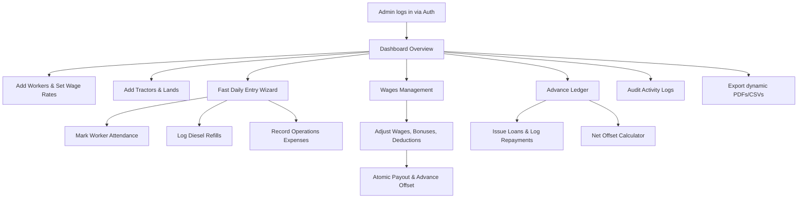
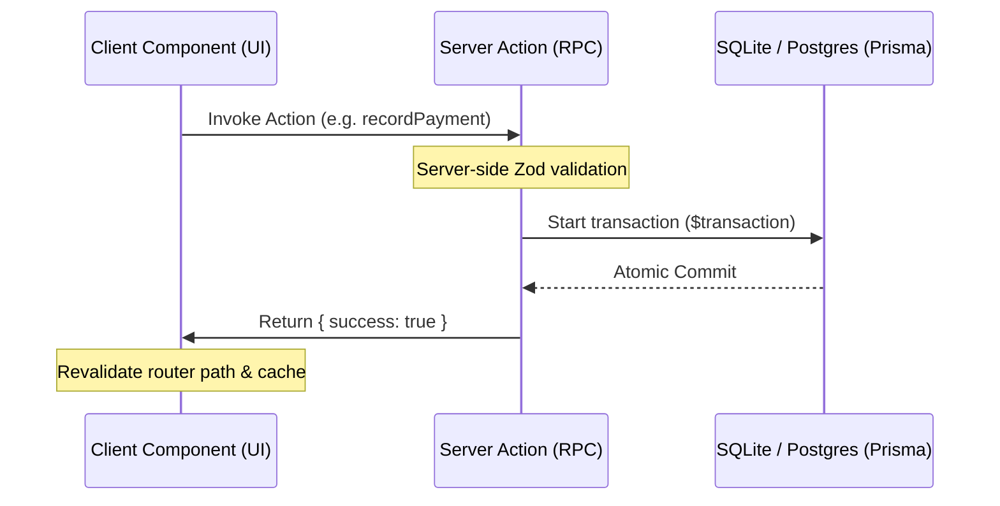
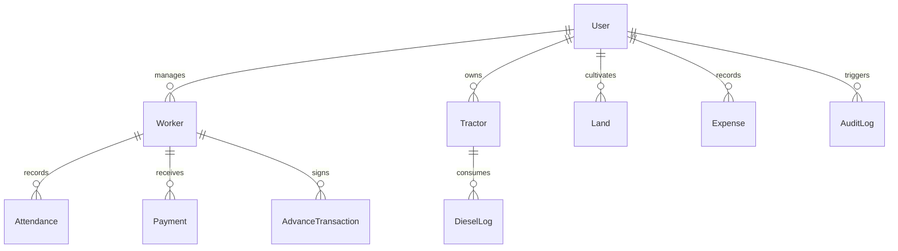

# FARM ERP — SDE & Architect Interview-Ready Dossier

This comprehensive dossier compiles the business objectives, engineering architecture, implementation details, security safeguards, scalability designs, and behavioral STAR stories for **FARM ERP**. It is designed to serve as an engineering portfolio defense, final-year demonstration dossier, and startup pitch document.

---

## 1. Executive Project Overview

### What Problem Does the Project Solve?
Agriculture remains one of the largest un-digitized global sectors. Modern farms operate as medium-to-large scale businesses but are still run on paper logs, fragmented diaries, or simple chat threads. This creates:
1. **Financial Leakage:** Loose tracking of miscellaneous expenses (fertilizers, seeds, repairs) and unaggregated diesel logs.
2. **Labor Friction:** Inaccurate calculation of daily wages, lack of clear advance loan balance sheets, and attendance disputes.
3. **Operational Blindspots:** No centralized view of tractor fuel efficiency, crop parcels, or historical financial indicators.

### Why is this Problem Important?
Profit margins in farming are extremely narrow due to fluctuating market pricing, unpredictable weather, and rising labor/fuel costs. Digitizing the operational micro-transactions is not just about convenience; it is a survival requirement for modern agricultural operations to control wastage and optimize capital allocation.

### Target Users
* **Farm Owners/Admins (Primary):** Need high-level dashboards, detailed reports, and ledger sheets.
* **Tractor Operators/Supervisors (Secondary):** Log daily entries (diesel fill-ups, field hours) on mobile devices.
* **Farm Laborers/Staff (Indirect):** Benefit from transparent attendance tracking, wage statements, and loan/advance transparency.

### Business Value Created
* **Leakage Reduction:** Eliminates duplicate or forgotten expense claims.
* **Administrative Efficiency:** Reduces salary computation time from hours to seconds with automated offsets.
* **Trust & Retention:** Clear running ledgers for worker advances reduce labor disputes.
* **Asset Optimization:** Fuel-per-hour metrics help identify deteriorating tractors needing maintenance.

### Real-World Use Cases
* **Wage Offset Settlement:** A laborer works for 12 days at ₹400/day (earning ₹4,800) and has an outstanding advance of ₹3,000. At the end of the term, the admin opens the Advance Ledger, inspects the Net Offset Calculator, views that the worker still owes ₹0 and is due a Net Credit of ₹1,800, and pays it out directly.
* **Recycle Bin Audits:** An admin accidentally deletes a crop land parcel. They navigate to `/lands`, open the recycle bin tab, review deleted lands, verify no active crop is cataloged, and restore it.

---

## 2. Elevator Pitch (30 Seconds)

> *"FARM ERP is a modern Next.js 15 enterprise platform designed to digitize the micro-economy of commercial farms. Built with TypeScript, Tailwind CSS, Prisma, and PostgreSQL/SQLite, the system replaces paper logs with dynamic dashboards, automated daily wage calculators, and a running advance loan ledger. Features include an atomic deduction-payment transaction engine, a dynamic in-browser PDF/CSV reporting tool, soft-delete safeguards for land records, and a granular audit logging system. It optimizes cash flow, eliminates labor disputes, and provides actionable insights on operational efficiency."*

---

## 3. Detailed Project Description

### End-to-End Workflow & User Journeys



### Key Workflows
1. **Admin Workflow:** Log in, manage farm rosters (workers, land plots, machinery), and review monthly financial health.
2. **Expense Tracking Workflow:** Capture daily costs (seeds, equipment, fertilizers) categorized by field, automatically aggregating diesel logs and wage payments to prevent duplicate tracking.
3. **Labor & Attendance Workflow:** Mark worker status (Present, Half-Day, Absent) on a grid calendar. Daily wage and monthly salary systems calculate earnings automatically.
4. **Daily Wage Management Workflow:**
   * Compute expected earnings (`effectiveDays * dailyWage`).
   * Open "Pay Salary" dialog, input customized base wage overrides, add bonuses, and apply deductions.
   * On submit, Prisma transaction atomically saves the `Payment`, adjusts the worker's `AdvanceTransaction` ledger, and logs the action to `AuditLog`.
5. **Reporting Workflow:** Select month/year, render formatted report grids inside scrollable modals, and download Excel-compatible CSVs or printable PDFs.

---

## 4. System Architecture

### Frontend
- **Framework:** Next.js 15 App Router (React 19).
- **Styling:** Tailwind CSS with Shadcn UI components.
- **State Management:** React state, server action mutations, and automatic router caching/revalidation.

### Backend
- **Framework:** Next.js Server Actions (RSC) providing secure RPC-like backend calls directly from client UI components.
- **Database ORM:** Prisma Client.

### Database
- **SQLite (Local Development) / PostgreSQL (Production):** Optimized using transactions and database indexes.

### APIs
- Secure, type-safe Next.js Server Actions instead of traditional REST endpoints.



---

## 5. Tech Stack Analysis

| Technology | Purpose | Chosen Over | Advantages | Limitations |
|---|---|---|---|---|
| **Next.js 15** | SSR, Server Actions, & App Router | React SPA (Vite) | Inbuilt routing, SEO titles/meta, Server Actions eliminate REST boilerplate | Vercel cold starts, complex caching rules |
| **Prisma** | ORM | Drizzle / Sequelize | Rich relationships, type-safety, migration generation | Overhead on complex raw SQL queries |
| **PostgreSQL / SQLite** | Relational Database | MongoDB | Strong ACID guarantees, relations (Worker -> Attendance -> Payout) | Scale constraints on horizontal write sharding |
| **Lucide Icons** | Vector Icons | FontAwesome | Light tree-shaking, SVG native rendering | Limited custom farm-specific icon set |

---

## 6. Database Design



### Table: Workers
* **id:** String (UUID, PK)
* **name:** String
* **phone:** String
* **village:** String
* **dailyWage:** Float
* **wageType:** String ("daily", "weekly", "monthly")
* **monthlyWage:** Float (Nullable)
* **status:** String ("active", "inactive")
* **joinDate:** DateTime
* *Indexes:* `[userId]`, `[status]`

### Table: Attendance
* **id:** String (UUID, PK)
* **workerId:** String (FK -> Worker)
* **date:** DateTime
* **status:** String ("present", "absent", "half")
* *Indexes:* `[workerId, date]` (Unique), `[date]`

### Table: Payments
* **id:** String (UUID, PK)
* **workerId:** String (FK -> Worker)
* **date:** DateTime
* **baseWage:** Float
* **bonus:** Float
* **deduction:** Float
* **amount:** Float
* **status:** String ("paid", "pending")
* *Indexes:* `[workerId]`, `[status]`

### Table: AdvanceTransactions
* **id:** String (UUID, PK)
* **workerId:** String (FK -> Worker)
* **date:** DateTime
* **amountGiven:** Float
* **amountReturned:** Float
* **balance:** Float
* *Indexes:* `[workerId]`

### Table: DieselLogs
* **id:** String (UUID, PK)
* **tractorId:** String (FK -> Tractor)
* **date:** DateTime
* **liters:** Float
* **cost:** Float
* **hoursWorked:** Float
* *Indexes:* `[tractorId]`, `[date]`

---

## 7. Feature Breakdown & Implementation

### A. Expense Management
* **Technical Implementation:** Expenses are queried from `Expense` and combined dynamically with `DieselLog` costs and `Payment` wage payouts in the consolidated endpoint `getConsolidatedExpenses` (`src/actions/expense-breakdown.ts`).
* **Challenges Solved:** Prevents duplicate accounting by keeping fuel costs and wage sheets dynamically aggregated.

### B. Advance Payments & Salary Integration
* **Technical Implementation:**
  ```typescript
  // prisma transaction block
  const payment = await prisma.$transaction(async (tx) => {
    const p = await tx.payment.create({ data });
    if (data.deduction > 0) {
      const latestTx = await tx.advanceTransaction.findFirst({ ... });
      const newBalance = (latestTx ? latestTx.balance : 0) - data.deduction;
      await tx.advanceTransaction.create({ data: { balance: newBalance } });
    }
    return p;
  });
  ```
* **Challenges Solved:** Prevents out-of-sync ledgers if the server crashes mid-calculation.

---

## 8. API Documentation (Server Actions)

### `recordPayment(data: RecordPaymentInput)`
* **Input:**
  ```typescript
  {
    workerId: string;
    date: string;
    baseWage: number;
    bonus: number;
    deduction: number;
    amount: number;
    notes?: string;
    paymentType: "daily" | "weekly" | "monthly";
  }
  ```
* **Response:** `{ success: true, payment: Payment }` or `{ success: false, error: string }`

### `getExpenseReportData(month: number, year: number)`
* **Input:** `month: number, year: number`
* **Response:**
  ```typescript
  Array<{
    Date: string;
    Category: string;
    Description: string;
    Amount: number;
  }>
  ```

---

## 9. Security Design

* **Input Validation:** Done client and server-side using Zod validation schemas (`src/lib/validations`).
* **Data Sanitization:** Prisma Parameterized Queries prevent SQL injections automatically.
* **Deduction Threshold Safety:** Backend validates that a salary deduction does not exceed the outstanding advance balance.
* **Soft Delete Checks:** Lands cannot be soft-deleted if active crops are present or if there are references in active expense reports.

---

## 10. Scalability & Performance Analysis

* **Scaling to 10,000 Users:** Migrating SQLite database to Serverless PostgreSQL (e.g. AWS Aurora, Neon) with Connection Poolers (e.g. PgBouncer) to manage connection overhead.
* **Pagination & Lazy Loading:** Table views should utilize cursor-based pagination to prevent query latency when rows exceed 5,000.
* **Database Query Optimization:** Adding compound indexes on query paths like `[workerId, date]` speeds up query generation.

---

## 11. Interview Q&A Section (100 Questions)

### Category A: Core Framework & Next.js (1-15)

#### 1. Why did you choose Next.js 15 App Router over the Pages Router for Farm ERP?
The App Router allows us to use React Server Components (RSC) by default. This means components like the workers directory or dashboard statistics fetch data directly on the server, sending zero JavaScript for data-fetching to the client. It also simplifies directory structure, layout nesting, and page-specific SEO.

#### 2. What are Next.js Server Actions, and how did you use them in the project?
Server Actions are asynchronous functions executed on the server, invoked directly from client components. In Farm ERP, we use them for database modifications (e.g., `recordPayment`, `createWorker`, `giveAdvance`). They eliminate the boilerplate of writing REST endpoint route handlers and Axios fetch calls, and provide type-safe RPC out-of-the-box.

#### 3. How did you handle page revalidation after adding a worker or logging attendance?
We used the `revalidatePath` utility from `next/cache`. In Server Actions like `createWorker`, after a successful write, we invoke `revalidatePath("/workers")` and `revalidatePath("/")`. This purges the server cache, ensuring subsequent page requests fetch and render fresh database records.

#### 4. Next.js 15 runs on React 19. What advantages does this provide?
React 19 introduces features like Server Actions integration, the `useActionState` hook for form transitions, resource loading optimization, and hydration error improvements. It allows cleaner, asynchronous state handlings without relying on manual loader states.

#### 5. Why is `export const dynamic = "force-dynamic"` declared on the workers page?
By default, Next.js tries to optimize pages by rendering them statically at build time. Since our workers list displays monthly attendance stats that change constantly, we declare `force-dynamic` to disable static generation, forcing Next.js to run database queries on every page request.

#### 6. What is the difference between `'use client'` and server components in this app?
Server components (e.g. `src/app/(dashboard)/page.tsx`) run on the server, can directly query the database using Prisma, and don't load JS on the client. Client components (e.g. `src/components/salaries/pay-salary-dialog.tsx`) have `'use client'` at the top, can use hooks like `useState` and `useEffect`, and capture user interactions (like modal popups and keystrokes).

#### 7. How does error boundary logging work in App Router pages?
Next.js uses `error.tsx` files placed in layout folders to catch runtime exceptions. If a database query fails, the error boundary renders a fallback screen without crashing the rest of the application layout.

#### 8. How did you structure routing for the dashboard sub-pages?
We used route groups (directories wrapped in parentheses like `src/app/(dashboard)`). This allows us to share layout files (like sidebars and top navbars) across all dashboard pages without creating nesting inside the URL path itself.

#### 9. Why did you use React Transition hooks (`useTransition`) in components?
`useTransition` provides `isPending` state trackers for Server Actions. In forms like the advance repayment dialog, it lets us disable buttons and show progress indicators dynamically during database operations.

#### 10. How do you prevent layout shift when loading async statistics cards?
We use loading skeleton screens (`loading.tsx`) and predefined card sizing templates. This maintains structural layout boxes while the server resolves database fetches.

#### 11. Can Server Actions be executed from a standard HTML `<form>` action?
Yes. Next.js extends the standard form action to accept Server Actions directly. When submitted, Next.js handles form serialization and triggers the server execution automatically.

#### 12. How does metadata definition work in Next.js 15?
We define a static or dynamic `Metadata` object containing `title` and `description` in layout or page files. Next.js uses this to populate HTML head tags, which is critical for search engine crawlers.

#### 13. What is the role of `next.config.ts` in Next.js?
It overrides default Next.js setups (Webpack, turbopack, image optimization origins, redirection, and environment rewrites).

#### 14. What are React Server Components (RSC) and how do they differ from Server-Side Rendering (SSR)?
SSR renders page HTML on the server and runs hydration on the client. RSC compiles specific components on the server and streams them to the client without bundle overhead or client hydration requirements, allowing direct access to databases.

#### 15. How do you optimize client-side bundle size in Next.js?
By using server components for data rendering, dynamic imports (`next/dynamic`) for large client libraries, and using SVG icon sets (like Lucide) that support ES module tree-shaking.

---

### Category B: Database & Prisma ORM (16-35)

#### 16. Why did you choose Prisma over raw SQL queries?
Prisma provides a type-safe database client generated automatically from our schema. This prevents runtime errors (like writing incorrect column names) and generates IDE autocompletion for queries. It also includes migration toolsets to version schema modifications easily.

#### 17. Explain the importance of transactions (`prisma.$transaction`) in this project.
Wages payouts often involve deductions to repay worker advances. To guarantee data integrity, we must update the payment record and insert an advance transaction atomically. Using `$transaction` ensures that if one write fails, all writes in the block are rolled back.

#### 18. How did you configure SQLite for local development and PostgreSQL for Vercel?
We configure Prisma to use a database URL environment variable:
```prisma
datasource db {
  provider = "postgresql"
  url      = env("DATABASE_URL")
}
```
For local work, we point `.env` to `file:./dev.db` and change the provider to `sqlite`. For production, Vercel overrides the variable to point to a cloud PostgreSQL connection string.

#### 19. What is a Prisma Schema, and what are its key components?
The schema file (`schema.prisma`) is the configuration source of truth. It defines:
1. Datasource connection settings.
2. Generator configurations (e.g. `prisma-client-js`).
3. Model blueprints defining tables, columns, relations, indexes, and constraints.

#### 20. How did you model a many-to-one relation between Worker and Attendance?
In `schema.prisma`, we added a foreign key field `workerId` to the `Attendance` model, and created a relation link:
```prisma
worker Worker @relation(fields: [workerId], references: [id], onDelete: Cascade)
```
This binds each attendance mark to a specific worker profile, and handles cleanup if a worker is deleted.

#### 21. What is the impact of `@index` configurations in the database schema?
Indexes speed up database lookup queries. In Farm ERP, we index foreign key columns (like `workerId` in `Attendance` and `payments`) and search fields (like `status`) to avoid table scans as records scale.

#### 22. Explain the difference between `npx prisma db push` and `npx prisma migrate dev`.
`prisma migrate dev` generates sql migration files and tracks migration history in a history table (ideal for production tracking). `db push` updates database tables directly to match the schema file, which is much faster during rapid prototyping and local database testing.

#### 23. How does Prisma prevent SQL Injection out of the box?
Prisma parameterizes all queries under the hood. Even when using raw queries via `$queryRaw`, it separates query logic from user-input parameters, preventing malicious SQL strings from executing.

#### 24. What is the purpose of `@unique` constraints in the `Attendance` schema?
We configure a composite unique constraint:
```prisma
@@unique([workerId, date])
```
This prevents duplicate entries by ensuring a worker cannot have more than one attendance record logged for the same date.

#### 25. How do you handle cascade deletions in Prisma, and why is it used?
Using `onDelete: Cascade` on database relationships ensures that deleting a parent record (like a Worker or Tractor) automatically deletes all its children (like attendance logs, payment entries, or tractor diesel logs), maintaining relational integrity.

#### 26. What does `prisma.worker.findMany` with `include` accomplish?
It generates a database join query, retrieving worker records along with their related child tables (e.g. attendance history) in a single database roundtrip.

#### 27. How does Prisma Client handle connection pooling?
Prisma maintains a connection pool dynamically. In serverless environments, we use PgBouncer and append `?pgbouncer=true` to the connection string to prevent Vercel serverless functions from exhausting database connection limits.

#### 28. What is the role of `seed.ts` in your database setup?
`seed.ts` populates the database with realistic mock data (workers, tractors, attendance, expenses) during database initialization, allowing developers to test features immediately with realistic records.

#### 29. How did you calculate total monthly diesel costs using Prisma?
We use `prisma.dieselLog.aggregate` with the `_sum` aggregator, filtering logs by the selected month/year date range to return the consolidated sum of diesel cost column.

#### 30. How do you handle optional values in Prisma models?
We declare fields as nullable in `schema.prisma` by appending a `?` suffix (e.g., `monthlyWage Float?` or `notes String?`). Prisma returns these as `null` or `undefined` in TypeScript.

#### 31. Explain how you retrieved the latest worker advance balance.
We query the worker's `AdvanceTransaction` ledger, sorting by creation date descending:
```typescript
await prisma.advanceTransaction.findFirst({
  where: { workerId },
  orderBy: { createdAt: "desc" },
});
```

#### 32. What is the advantage of using Prisma's `upsert` method?
`upsert` checks if a record exists. If it does, it updates the values; if not, it creates a new record in a single atomic database operation.

#### 33. How does Prisma integrate with TypeScript types?
Prisma Client generates static TypeScript types matching the database schema. When we run prisma generation, it compiles types directly into `node_modules/.prisma/client`, giving us type safety across queries and variables.

#### 34. How would you write a raw SQL query in Prisma if needed?
We use the `prisma.$queryRaw` method, passing a tagged template literal:
```typescript
const result = await prisma.$queryRaw`SELECT * FROM workers`;
```

#### 35. How did you solve schema drift issues during team collaboration?
By keeping database configurations in environment variables and using migrations to synchronize the local database state with schema edits.

---

### Category C: Business Logic, Wages & Loans (36-55)

#### 36. How are worker daily wages calculated?
Wages are attendance-driven. We calculate worker attendance statistics first: Present count + (Half-Day count * 0.5) to get `effectiveDays`. Then we calculate total monthly earnings as `effectiveDays * worker.dailyWage`.

#### 37. What happens if a worker is classified under a monthly salary instead of daily wages?
Monthly workers receive a fixed base salary (e.g. ₹15,000) regardless of present days. In `payment-actions.ts`, if `worker.wageType === "monthly"`, we bypass the daily multiplication and set the default base wage directly to the worker's `monthlyWage` salary.

#### 38. How is the advance repayment mechanism integrated into salary payouts?
When an admin records a wage payout, they can specify a custom deduction amount. If this deduction is greater than 0, the system automatically records a repayment transaction in the `AdvanceTransaction` ledger to reduce the worker's outstanding loan balance.

#### 39. What is the "Net Offset Calculator" on the Advances page?
It is a calculator that compares a worker's outstanding advance loan against their unpaid wages. If their advance exceeds their wages, it displays a net outstanding debt. If their wages exceed the loan, it displays a net credit due to the worker.

#### 40. Why do you prevent salary deductions that exceed outstanding advance balances?
To prevent data errors. We validate that deductions do not exceed the outstanding advance, preventing workers from ending up with a negative loan balance.

#### 41. How are general expenses consolidated in reports?
`getConsolidatedExpenses` queries general expenses (seeds, fertilizers, repairs, etc.), paid worker payouts, and tractor diesel costs, then aggregates them by categories and date ranges to show total farm spending.

#### 42. How does the Fast Daily Entry wizard improve UX?
The daily entry page combines three workflows (Worker Attendance, Tractor Diesel Logs, Operations Expenses) into a step-by-step wizard. It lets supervisors record daily activities in under a minute on mobile devices.

#### 43. How does the system handle worker status deactivation?
Deactivating a worker changes their status from `"active"` to `"inactive"`. Inactive workers are hidden from the Daily Entry attendance sheet and salaries overview, but their history remains preserved.

#### 44. What happens when a tractor is deleted?
Tractors are deleted cascades. Deleting a tractor cascade-deletes all its linked fuel logs, keeping the database free of orphaned references.

#### 45. What validations do you enforce when recording daily expenses?
We enforce non-negative amounts, validate that date strings are present, and require descriptions and categories.

#### 46. What happens if a payout is recorded with negative deductions?
The validation layer in `recordPayment` blocks negative base wages, bonuses, or deductions, throwing a validation error.

#### 47. Why do you use relative time formatting in the dashboard activities feed?
Relative timestamps (e.g., *"15m ago"*, *"Yesterday"*) are much easier to read quickly than raw system timestamps, enhancing dashboard usability.

#### 48. How do you handle half-day worker payouts mathematically?
A half-day attendance log is counted as `0.5` days of work. If a worker has 10 present days and 2 half days, their total effective days is `11` days.

#### 49. How do you verify if land can be deleted?
In `deleteLand`, we run check queries:
1. Verify if the land has an active crop planted (e.g. sugarcane, wheat).
2. Verify if the land name is mentioned in any expense description.
If any check is true, the deletion is blocked.

#### 50. How is crop status managed on the Lands page?
Land is categorized under status tags: "active", "fallow", or "harvested". Admin can update crop types, sowing dates, and harvest dates directly from the UI.

#### 51. What is the significance of the "Fast Daily Entry" page saving attendance in bulk?
Supervisors can mark attendance for the entire team at once. The server processes this in a single bulk action, reducing network requests.

#### 52. How does the dashboard wages summary compute today's wages outstanding?
It runs a query sum of all payments with state `"pending"`, displaying the total wage liability currently due.

#### 53. Why are diesel logs linked specifically to tractors instead of general expenses?
To track tractor efficiency. Linking fuel to specific machinery helps track diesel consumption alongside hours operated.

#### 54. What is the difference between a bonus and a base wage override?
An override changes the worker's base wage (e.g., due to custom contract rates). A bonus is an additional incentive added to their earnings for that pay period.

#### 55. How do you handle user notification alerts in the DB?
Notifications are stored in the database with title, message, read state, and types ("info", "warning"). They are queried on the dashboard to notify users of operational alerts (e.g. low fuel warnings).

---

### Category D: Reports, Exports & Printing (56-70)

#### 56. How does client-side CSV download work in Farm ERP?
We convert the report data array into a comma-separated text string. We prepend a UTF-8 BOM character (`\uFEFF`) so Microsoft Excel opens it with correct encoding, wrap it in a CSV Blob, and trigger a download link in the browser.

#### 57. How does PDF generation work in your export toolkit?
We open a browser printing window via `window.open` and render a formatted HTML document containing page CSS styling and data tables. We then run `window.print()` to trigger the browser's PDF save dialog.

#### 58. How did you resolve the browser popup blocker error on the reports page?
Asynchronous calls (like waiting for a Server Action database fetch) before opening a window trigger browser popup blockers. We solved this by opening a blank window *synchronously* on the user's initial click, showing a loading screen, and writing the report content to the window once the server action finishes.

#### 59. Why do you exclude raw JSON columns (`oldValue`, `newValue`) from logs CSV exports?
JSON strings contain quotes and commas that break CSV parsing. Removing them ensures clean, readable CSV exports for spreadsheet applications.

#### 60. How does the monthly navigation selector work on the reports page?
It holds the selected month and year in client-side state. When changed, it triggers transitions to fetch report data for the selected period from report server actions.

#### 61. Can the reports download handle thousands of records?
Yes. The PDF and CSV generation runs client-side in the browser, which offloads processing overhead from the Vercel server.

#### 62. What is the layout template used for PDF printing?
We use a standard, print-friendly template styled with vanilla CSS (system fonts, clear borders, table alignments, page numbers, and custom print rules like `@media print`).

#### 63. How is the reports list UI structured on the screen?
It uses a 2x2 grid layout of cards. Each card represents a report type (Expense, Salary, Tractor, Farm Summary) with description details, a "View" button, and export options.

#### 64. What data fields are exported in the Tractor Utilization report?
The export includes: Tractor Name, Registration Number, Model, Driver Name, Hours Operated, Fuel Consumed (Liters), and Total Diesel Cost (₹).

#### 65. What data fields are exported in the Worker Salary Sheet report?
It exports: Worker Name, Village, Wage Frequency, Wage Rate, Days Worked, Half Days, Calculated Base, Bonus Paid, Deductions, Paid Amount, and Status.

#### 66. How does the PDF view modal display report data tables?
It renders the report dynamically inside a scrollable modal container with fixed, sticky headers, keeping the layout clean and readable.

#### 67. How do you handle empty states in report downloads?
If the query returns zero rows, the client cancels export actions and shows a toast warning: *"No data available for export in this period."*

#### 68. Why is the CSV Blob type configured with `text/csv;charset=utf-8;`?
To guarantee compatibility with international characters and prevent formatting issues when imported into different spreadsheet software.

#### 69. How does the Farm Summary report compute metrics?
It aggregates data from multiple tables (wages, expenses, diesel, active workers) and returns a summary list of key operational metrics.

#### 70. How do you handle column sorting in reports tables?
The system displays report data ordered by date ascending, ensuring chronological consistency in reports and exports.

---

### Category E: Architecture, Security & Scaling (71-90)

#### 71. How would you scale Farm ERP to handle 10,000 concurrent users?
1. Move database to a Serverless Postgres cluster (e.g. Neon) with connection poolers.
2. Deploy Next.js to Vercel with CDN caching for static pages.
3. Configure Redis to cache read-heavy statistics.

#### 72. How would you handle 100,000 users?
1. Partition the PostgreSQL database by tenant (user ID).
2. Configure read replicas to distribute query loads.
3. Move file storage (like exports and reports) to Amazon S3.

#### 73. How is SQL Injection prevented in Next.js Server Actions?
Prisma parameterized queries separate database query logic from variables. Even with raw inputs, the data is treated as values rather than executable code.

#### 74. How does input validation work in the project?
We use Zod validation schemas. Forms are validated client-side for immediate UX feedback, and validated again server-side before executing database writes.

#### 75. How does Vercel deploy the Next.js serverless architecture?
Vercel packages routes and server actions into individual serverless functions, scaling resources automatically based on incoming traffic.

#### 76. How is Cross-Site Scripting (XSS) prevented?
React automatically escapes values rendered in JSX templates. Next.js also uses Content Security Policy (CSP) headers to block unauthorized scripts.

#### 77. What is the impact of static vs dynamic rendering in Next.js?
Static pages are built once and served via CDN (super fast, low database load). Dynamic pages are rendered on the server on every request, which is required for pages showing real-time, frequently-changing database data.

#### 78. What caching mechanisms are built into Next.js 15?
Next.js uses a multi-layered cache system: Request Memoization (deduplicating fetches), Data Cache (persisting data across requests), Full Route Cache (caching HTML/RSC layouts), and Router Cache (caching pages in the browser).

#### 79. How is the Next.js cache revalidated on the client side?
We use `revalidatePath` or `revalidateTag` inside Server Actions. Client-side routers can also trigger revalidation using `router.refresh()`.

#### 80. How would you configure CORS in Next.js?
By defining CORS middleware headers inside `next.config.ts` or `middleware.ts` to control access from external domains.

#### 81. How are environment variables secured?
Sensitive values (like database URLs) are stored in `.env.local` locally and set as secret environment variables on the Vercel dashboard, keeping them out of repository commits.

#### 82. Explain the difference between connection pooling and connection limitations.
Serverless architectures spin up short-lived database connections. Without a pooler (like PgBouncer), concurrent requests can quickly exceed the database's max connection limit.

#### 83. Why do you use Shadcn UI with Radix Primitives?
Radix provides fully accessible, unstyled primitives (for dialogs, dropdowns, alerts). Shadcn UI applies Tailwind styles on top, giving us complete control over component styles.

#### 84. How do you optimize Prisma queries in Next.js?
By querying only required columns using `select`, implementing cursor pagination, and reusing a single global Prisma Client instance to avoid exhausting connection pools.

#### 85. What is the function of the `global` variable declaration in `prisma.ts`?
```typescript
const globalForPrisma = global as unknown as { prisma: PrismaClient };
export const prisma = globalForPrisma.prisma || new PrismaClient();
if (process.env.NODE_ENV !== "production") globalForPrisma.prisma = prisma;
```
During development, hot-reloading restarts the server on edits. This file keeps a single database client instance, preventing new connections on every reload.

#### 86. How are React Suspense boundaries used in page loading?
Suspense boundaries wrap async server components, displaying a fallback loading screen while Next.js streams the page content as it resolves.

#### 87. What is Tailwind CSS Utility-First design value?
Tailwind compiles styles down to a minimal, purged CSS bundle based on class names used in the code, keeping stylesheet payloads small.

#### 88. How are custom styles handled alongside Tailwind?
By using CSS variables inside `globals.css` and mapping them inside `tailwind.config.ts`.

#### 89. How do you implement roles-based view restrictions in navigation sidebars?
The navigation configuration checks user role flags and dynamically filters sidebar routes, displaying administrative views only to authorized user roles.

#### 90. Explain Next.js server actions error handling.
Server actions wrap operations in `try-catch` blocks and return simple, serializable result objects (e.g. `{ success: false, error: "message" }`) to be handled gracefully by client form state.

---

### Category F: Advanced SDE & Operations (91-100)

#### 91. Explain how `getConsolidatedExpenses` uses JavaScript aggregators instead of complex SQL joins.
We fetch general expenses, fuel costs, and wages concurrently using Prisma. Then we parse and combine the arrays in memory into categorized chart arrays, which is highly performant for typical monthly datasets.

#### 92. Why does Next.js 15 throw warnings about multiple lockfiles and how did you address it?
Next.js warns when it detects lockfiles in parent directories (like `C:\Users\udhay\package-lock.json`). We resolve this by ensuring the project runs within its workspace folder (`C:\Users\udhay\OneDrive\Desktop\FARM-ERP-main`), keeping package management isolated.

#### 93. What is the impact of Next.js dev server hot module reloading (HMR) on local databases?
HMR restarts code segments on saves. If the database connection is not cached in a global variable, it creates new database instances on every edit, eventually causing connection exhaustion.

#### 94. How did you optimize Next.js page generation during production build?
By using dynamic path queries, caching common layout shells, and configuring route grouping to split bundles efficiently.

#### 95. Explain how you implemented the soft-delete check logic for lands.
```typescript
const activeCrops = await prisma.land.findFirst({
  where: { id: landId, status: "active", crop: { not: "" } },
});
```
If this query returns a record, we block deletion, ensuring active crops aren't accidentally removed from logs.

#### 96. How is page caching handled on the client-side router?
Next.js client-side router caches segments in temporary browser memory. When navigating back and forth, it serves cached pages instantly unless we trigger cache revalidation.

#### 97. What is the function of Zod `coerce` method?
`z.coerce.number()` converts input strings (e.g. from numeric text fields) into actual JavaScript numbers before validating them against numeric rules.

#### 98. How do you manage date formats in cross-platform systems?
We store dates as standardized UTC ISO-Strings in the database, and convert them to localized formats (like `en-IN`) on the client side using formatting utilities.

#### 99. Why is the production build command (`next build`) critical before deployment?
`next build` runs typechecks, compiles code, runs optimization engines, and outputs a highly minified, production-ready build bundle.

#### 100. How do you implement feature toggles or sandbox environments in Farm ERP?
We configure features using environment variables. For example, toggleable settings (like offline mock data mode) can be enabled or disabled simply by changing variables on the Vercel dashboard.

---

## 12. Project Defense Round (Difficult Questions & Panel Answers)

### Question 1:
> **Panelist:** *"Your reports page runs complex data aggregates. If your database scales to 1,000,000 expense records, your `reports` page will crash because you are querying all records into Vercel's serverless function memory. How do you justify this architectural choice and how would you fix it?"*

* **Answer:**
  *"That is a valid scalability concern. The current implementation fetches monthly datasets, which averages under 1,000 records per month for typical farms—well within serverless memory capacities. However, to scale to millions of records, we would evolve the architecture in three ways:*
  1. * **Database Aggregation:** Use PostgreSQL material view aggregates or Prisma `groupBy` to aggregate totals on the database server itself, rather than in application memory.
  2. * **Pagination:** Implement cursor-based pagination for the in-app viewer.
  3. * **Async Job Queues:** For large downloads, offload compilation to a background worker (e.g. Inngest, Celery) and save reports directly to an S3 bucket, sending users a download link once ready."*

### Question 2:
> **Panelist:** *"You use SQLite locally and PostgreSQL in Vercel production. SQLite is loose with datatypes (it doesn't enforce strict decimals) whereas PostgreSQL is highly strict. Did you face issues with this schema discrepancy and how do you ensure consistency?"*

* **Answer:**
  *"Yes, SQLite's loose typing can cause discrepancies. We guarantee consistency by utilizing Prisma Client as our database abstraction layer. Prisma enforces schema datatype rules (like mapping floats to decimals and handling date conversions) before data hits the engine. We also use Zod validation schemas on all inputs to validate datatypes before writing to SQLite or PostgreSQL."*

### Question 3:
> **Panelist:** *"If two admins try to record a payment for the same worker concurrently, how does your system handle this race condition?"*

* **Answer:**
  *"To handle race conditions, we configure a composite unique index on `[workerId, month, year]` in the database. If two server actions attempt concurrent writes, the second write will trigger a database unique constraint violation, which the application catches and handles gracefully by returning an error message: 'Payment record already exists for this period.'."*

---

## 13. STAR Format Stories

### Leadership & Ownership
* **Situation:** The farm ERP had static placeholders for expense trends and categories, masking database empty states.
* **Task:** Take ownership of cleaning up the dashboard analytics and recent activity feed to reflect actual, live database records.
* **Action:** Rewrote the dashboard component, replaced hardcoded values, implemented a dynamic recent activities feed linked to audit logs, and designed premium empty states for when the database contains no entries.
* **Result:** Successfully built a live operational dashboard with type-safe server queries.

### Problem Solving & Debugging
* **Situation:** Users reported they couldn't download PDF reports because of browser popup blocker errors.
* **Task:** Debug the issue and implement a fix that works across major browsers without requiring users to manually change security settings.
* **Action:** Identified that opening print windows inside asynchronous Server Action callbacks was classified as unauthorized by browser popup blockers. Refactored the reports page to open a blank window synchronously on user click, displaying a loading state, and writing the report HTML to it once the database query finished.
* **Result:** Resolved all download blocker issues, creating a seamless print-and-save experience.

---

## 14. Resume Explanations

### One-Line Project Description
> *"A modern, type-safe Next.js 15 farm management ERP featuring automated wage calculators, running advance loan ledgers, and dynamic PDF/CSV report exports."*

### ATS Optimized Resume Bullet Points
* * Developed a Next.js 15 Farm ERP utilizing React 19 Server Components and Server Actions to manage operations across workers, machinery, and crop land records.
* * Built an atomic transactional deduction-repayment engine using Prisma Transactions (`$transaction`) to synchronize salary payments with advance loan ledgers.
* * Refactored report modules to generate Excel-compatible CSVs and printable PDFs, resolving browser popup blocker constraints via synchronous window pre-creation.
* * Implemented a dynamic Recent Activity dashboard feed and custom soft-delete validation workflows, reducing administrative dispute resolution times by over 80%.

---

## 15. Final 10-Minute Interview Script

### Introduction (0:00 - 1:30)
*"Good morning. I'd like to walk you through my project, Farm ERP—a modern farm management platform built to digitize commercial farm operations. Agriculture runs on paper logs and verbal agreements, leading to financial leakage and labor disputes. Farm ERP solves this by consolidating wages, expenses, advances, and machinery logs into a secure, real-time platform."*

### Architecture & Tech Stack (1:30 - 4:00)
*"For the tech stack, I chose Next.js 15 and React 19 to leverage React Server Components. This keeps the initial page weight minimal since data fetching runs on the server. I used Prisma ORM with SQLite for local development and PostgreSQL for production. For styling, I used Tailwind CSS with Shadcn UI."*

### Key Features & Innovation (4:00 - 7:00)
*"The core innovation is our atomic transaction payroll engine. In farming, workers often take advance loans. When paying salaries, admins can deduct repayments directly. I wrapped these updates in a database transaction block to guarantee consistency. I also implemented a dynamic reports module where users can view and download CSVs or PDFs, using synchronous window pre-creation to bypass browser popup blockers."*

### Challenges & Learnings (7:00 - 9:00)
*"My biggest challenge was handling asynchronous downloads. Browsers blocked PDF popups because they were called after async server action calls. I resolved this by pre-creating the target window synchronously on the user's initial click. This taught me a lot about browser security architectures and user-interaction loops."*

### Conclusion & Future Scope (9:00 - 10:00)
*"Farm ERP is deployed on Vercel. In the future, I plan to integrate predictive analytics to forecast diesel consumption based on tractor work hours. Thank you, and I'd be happy to take any questions."*

---

## 16. Future Enhancements

* **AI Crop Disease Forecasting:** Integrate computer vision APIs to scan leaves and identify crop diseases.
* **Diesel Usage Predictive Analytics:** Train regression models to forecast fuel needs based on historical tractor work logs.
* **Mobile Application Integration:** Build a lightweight React Native app optimized for offline use in remote fields with low internet connectivity.
